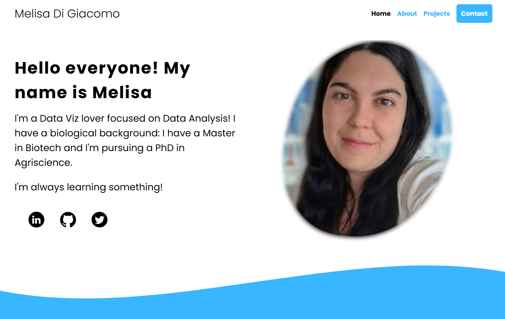
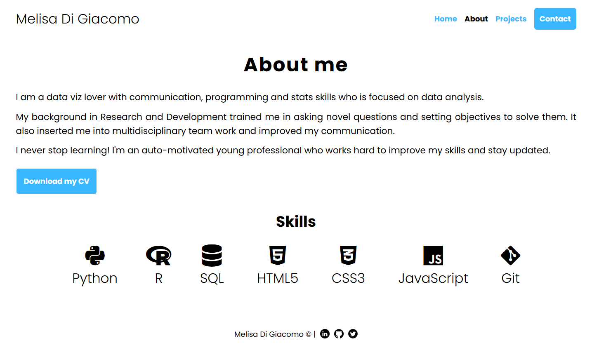
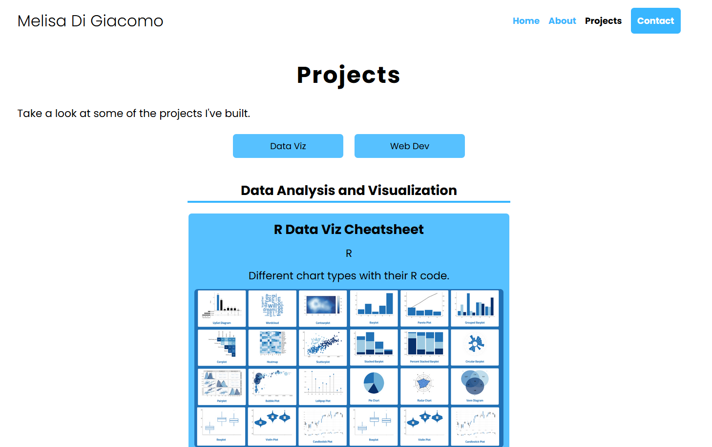
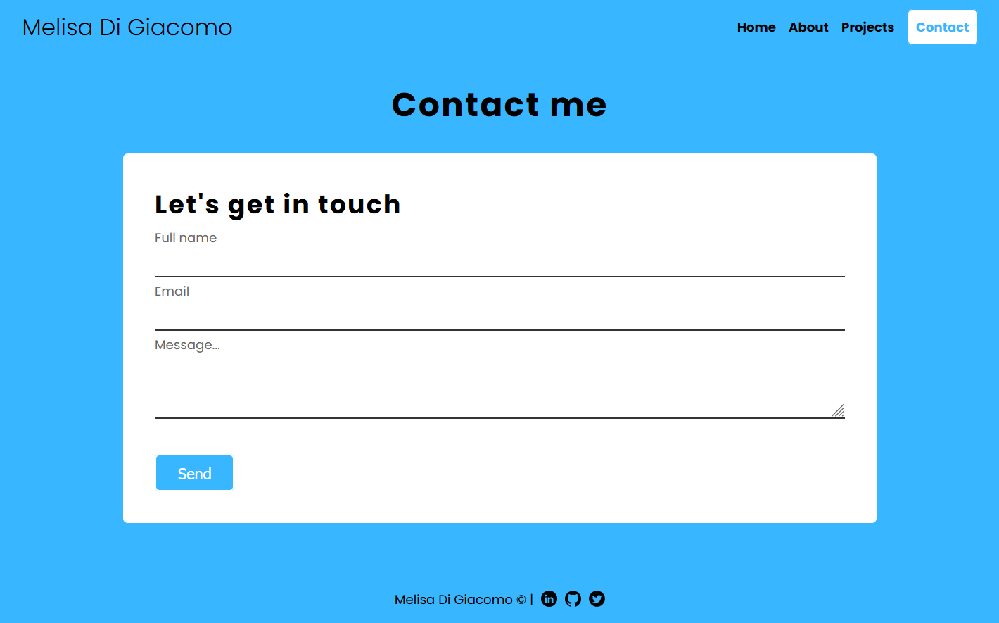

# My Web Portfolio

### [LINK HERE!](https://melisadigiacomo.github.io/melisadigiacomo-portfolio/index.html)

## Resources Used
&nbsp;
&nbsp;
&nbsp;  

## Development process:
I developed 4 HTML pages for my web portfolio: home, about, projects and contact. 
* Correct use of HTML5 semantic tags.
* Layouts using grid and flexbox.
* Transformations (color and scale changes) and transitions (smoothness).
* Fontawesome icons, Google fonts and custom gifs and images.
* Aesthetics: clean design with attractive visualization.
* Functional contact form, validated with JavaScript and secure (honeypot to detect bots and encodes email within an API).
* Responsive design with 4 breakpoints (desktop, laptop, tablet and mobile).
* Code in [GitHub Repo](https://github.com/melisadigiacomo/melisadigiacomo-portfolio).
* Free hosting in GitHub Pages.

  

## Home

  

## About

  

## Projects

  

## Contact

  
